[](https://classroom.github.com/a/YFgwt0yY)

# MiniTorch Module 2


* Docs: https://minitorch.github.io/
* Overview: https://minitorch.github.io/module2/module2/

This assignment requires the following files from the previous assignments. You can get these by running

```bash
python sync_previous_module.py previous-module-dir current-module-dir
```

The files that will be synced are:

    minitorch/operators.py minitorch/module.py minitorch/autodiff.py minitorch/scalar.py minitorch/scalar_functions.py minitorch/module.py project/run_manual.py project/run_scalar.py project/datasets.py


## Training results

### Simple

Size of hidden layer=2

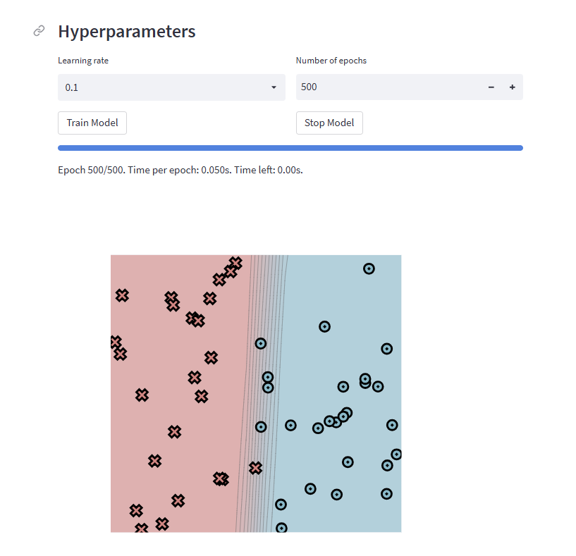

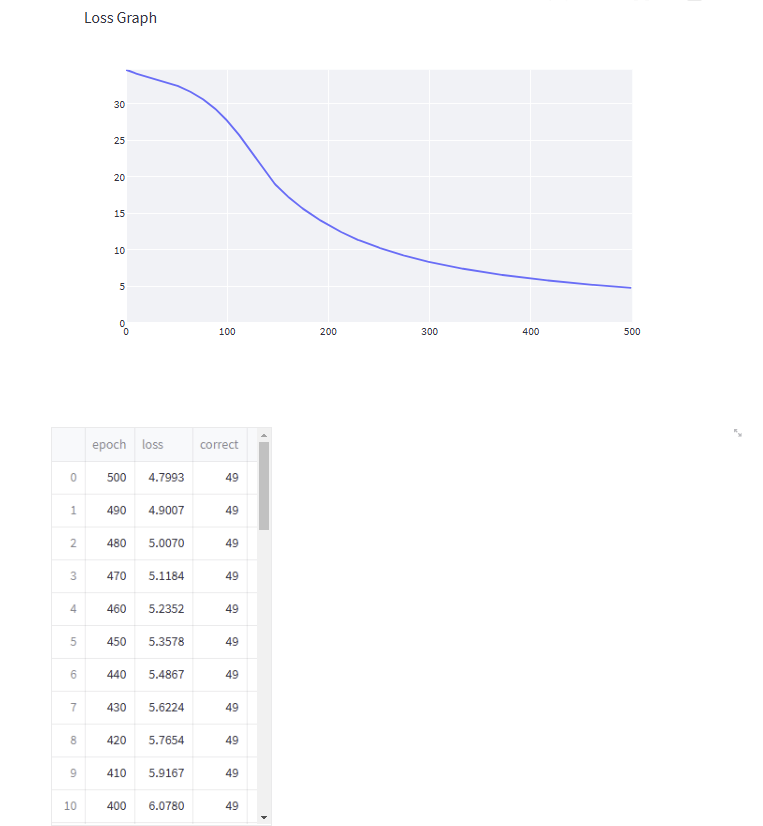

```
Epoch: 0/500, loss: 0, correct: 0
Epoch: 10/500, loss: 34.18042969480741, correct: 26
Epoch: 20/500, loss: 33.79421855770677, correct: 38
Epoch: 30/500, loss: 33.42782652351371, correct: 42
Epoch: 40/500, loss: 33.02294613675322, correct: 43
Epoch: 50/500, loss: 32.54161372509723, correct: 42
Epoch: 60/500, loss: 31.954818926088137, correct: 42
Epoch: 70/500, loss: 31.226035309563045, correct: 43
Epoch: 80/500, loss: 30.320174294567618, correct: 43
Epoch: 90/500, loss: 29.199111686486603, correct: 43
Epoch: 100/500, loss: 27.815351659113364, correct: 44
Epoch: 110/500, loss: 26.197105857842118, correct: 43
Epoch: 120/500, loss: 24.378662112238658, correct: 44
Epoch: 130/500, loss: 22.43490258949483, correct: 45
Epoch: 140/500, loss: 20.470173655259796, correct: 45
Epoch: 150/500, loss: 18.73299583461337, correct: 45
Epoch: 160/500, loss: 17.407889277886177, correct: 45
Epoch: 170/500, loss: 16.23941377479461, correct: 45
Epoch: 180/500, loss: 15.211410539835406, correct: 45
Epoch: 190/500, loss: 14.290496591725596, correct: 46
Epoch: 200/500, loss: 13.461799676961729, correct: 46
Epoch: 210/500, loss: 12.695075286917309, correct: 46
Epoch: 220/500, loss: 11.988281819179331, correct: 46
Epoch: 230/500, loss: 11.377069374721817, correct: 47
Epoch: 240/500, loss: 10.835805760639783, correct: 47
Epoch: 250/500, loss: 10.335605329889185, correct: 48
Epoch: 260/500, loss: 9.872889843446341, correct: 48
Epoch: 270/500, loss: 9.44463183712682, correct: 48
Epoch: 280/500, loss: 9.047967797013264, correct: 48
Epoch: 290/500, loss: 8.680359987492778, correct: 48
Epoch: 300/500, loss: 8.352011702621686, correct: 48
Epoch: 310/500, loss: 8.050857941422157, correct: 48
Epoch: 320/500, loss: 7.769145783572857, correct: 48
Epoch: 330/500, loss: 7.507869253149168, correct: 48
Epoch: 340/500, loss: 7.264633378275478, correct: 48
Epoch: 350/500, loss: 7.036415031493434, correct: 48
Epoch: 360/500, loss: 6.821613370361234, correct: 48
Epoch: 370/500, loss: 6.61918189643916, correct: 48
Epoch: 380/500, loss: 6.428516206363243, correct: 49
Epoch: 390/500, loss: 6.2482961519531335, correct: 49
Epoch: 400/500, loss: 6.077977180939434, correct: 49
Epoch: 410/500, loss: 5.916691147110107, correct: 49
Epoch: 420/500, loss: 5.765366659251502, correct: 49
Epoch: 430/500, loss: 5.622428591406707, correct: 49
Epoch: 440/500, loss: 5.486723332486673, correct: 49
Epoch: 450/500, loss: 5.357811283752437, correct: 49
Epoch: 460/500, loss: 5.235167857879437, correct: 49
Epoch: 470/500, loss: 5.1183677313127465, correct: 49
Epoch: 480/500, loss: 5.007035103808185, correct: 49
Epoch: 490/500, loss: 4.900718338848107, correct: 49
Epoch: 500/500, loss: 4.799306349198105, correct: 49

```

### Diag

Size of hidden layer=2

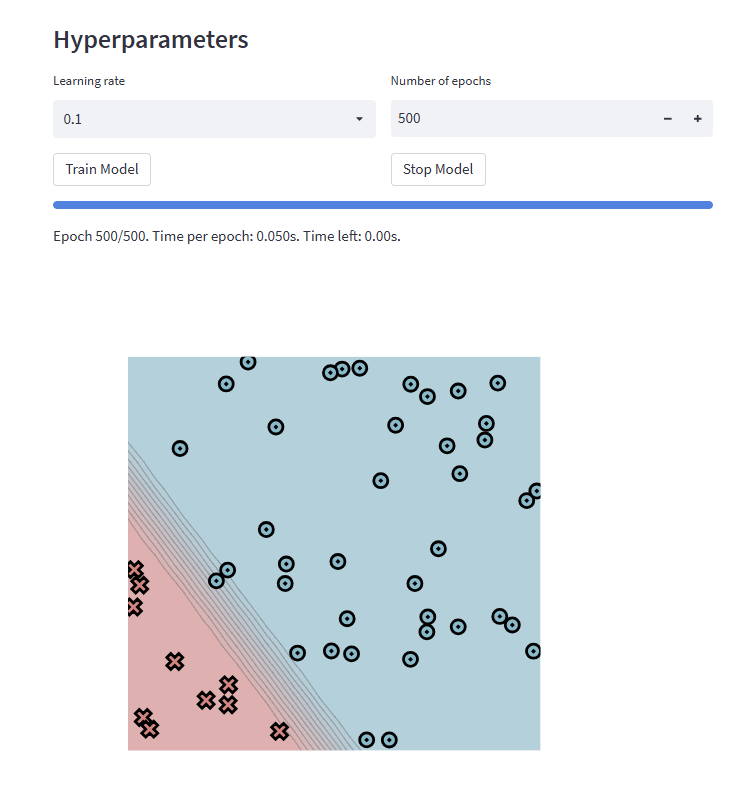

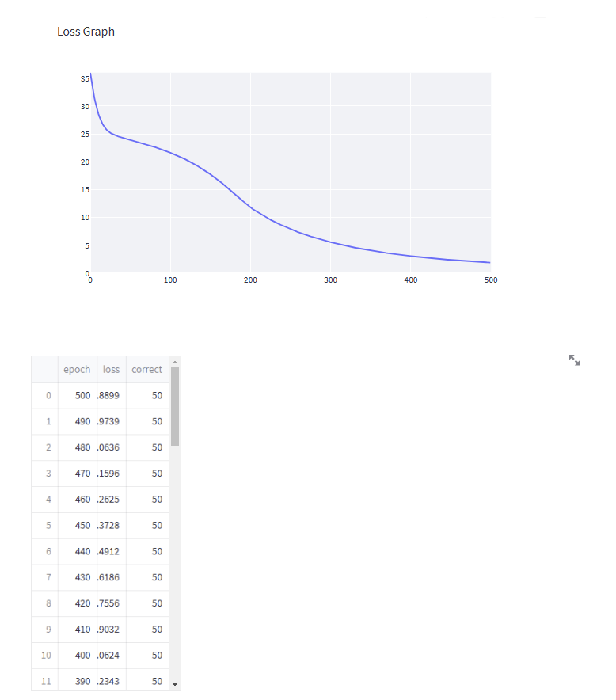

```
Epoch: 0/500, loss: 0, correct: 0
Epoch: 10/500, loss: 29.169205743178132, correct: 40
Epoch: 20/500, loss: 25.96057337037662, correct: 40
Epoch: 30/500, loss: 24.872983308551408, correct: 40
Epoch: 40/500, loss: 24.355549559386272, correct: 40
Epoch: 50/500, loss: 23.947698162958044, correct: 40
Epoch: 60/500, loss: 23.549528063623573, correct: 40
Epoch: 70/500, loss: 23.134776737764152, correct: 40
Epoch: 80/500, loss: 22.690440620315922, correct: 40
Epoch: 90/500, loss: 22.205718498949224, correct: 40
Epoch: 100/500, loss: 21.669846012655146, correct: 40
Epoch: 110/500, loss: 21.071527028881544, correct: 40
Epoch: 120/500, loss: 20.398834592154433, correct: 40
Epoch: 130/500, loss: 19.639561787403913, correct: 40
Epoch: 140/500, loss: 18.783138360924635, correct: 40
Epoch: 150/500, loss: 17.82327747719869, correct: 40
Epoch: 160/500, loss: 16.757884350839262, correct: 40
Epoch: 170/500, loss: 15.596906853303267, correct: 40
Epoch: 180/500, loss: 14.364158864682581, correct: 41
Epoch: 190/500, loss: 13.099350056266875, correct: 43
Epoch: 200/500, loss: 11.861750924190876, correct: 46
Epoch: 210/500, loss: 10.926349643426262, correct: 46
Epoch: 220/500, loss: 10.064044368130187, correct: 47
Epoch: 230/500, loss: 9.273010850071952, correct: 47
Epoch: 240/500, loss: 8.589005061784244, correct: 48
Epoch: 250/500, loss: 7.957568742599588, correct: 49
Epoch: 260/500, loss: 7.375371111753351, correct: 49
Epoch: 270/500, loss: 6.862593123784231, correct: 49
Epoch: 280/500, loss: 6.402097778652606, correct: 49
Epoch: 290/500, loss: 5.977157259852765, correct: 49
Epoch: 300/500, loss: 5.587175932178042, correct: 49
Epoch: 310/500, loss: 5.226922182223248, correct: 50
Epoch: 320/500, loss: 4.896478911515946, correct: 50
Epoch: 330/500, loss: 4.596416252601533, correct: 50
Epoch: 340/500, loss: 4.323440759836201, correct: 50
Epoch: 350/500, loss: 4.070717906033909, correct: 50
Epoch: 360/500, loss: 3.836753682965265, correct: 50
Epoch: 370/500, loss: 3.6202115988615233, correct: 50
Epoch: 380/500, loss: 3.419794764990122, correct: 50
Epoch: 390/500, loss: 3.2342598409297176, correct: 50
Epoch: 400/500, loss: 3.0624271270805004, correct: 50
```

### Split

Size of hidden layer=2

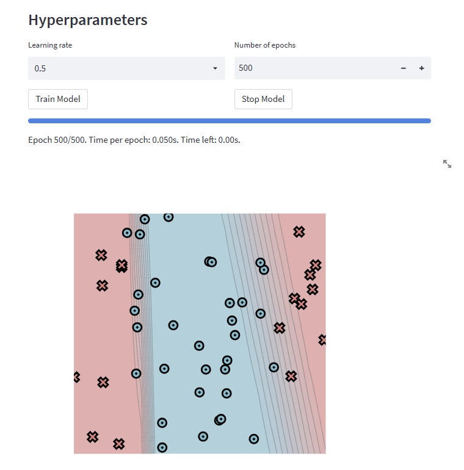

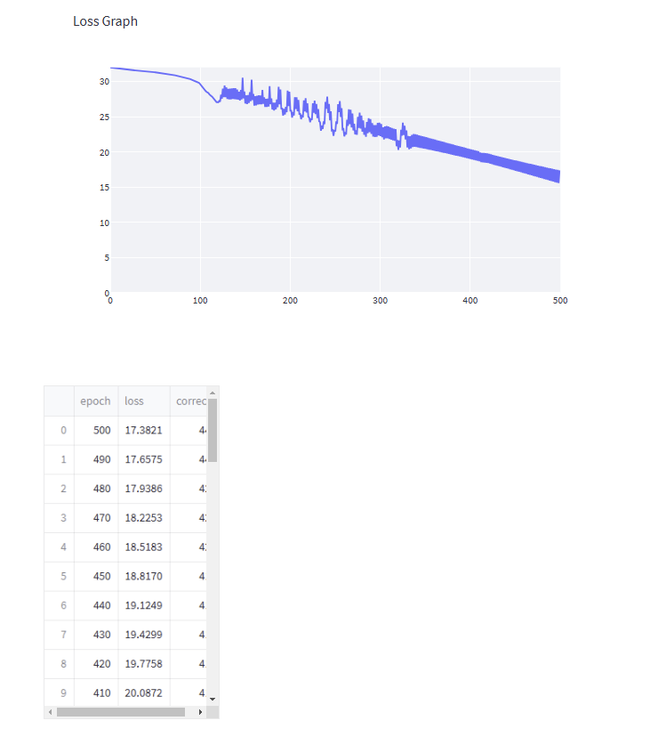

```
Epoch: 0/500, loss: 0, correct: 0
Epoch: 10/500, loss: 31.813293683452166, correct: 33
Epoch: 20/500, loss: 31.660699324883826, correct: 33
Epoch: 30/500, loss: 31.558838872112588, correct: 33
Epoch: 40/500, loss: 31.443265519092254, correct: 33
Epoch: 50/500, loss: 31.30415980848631, correct: 33
Epoch: 60/500, loss: 31.139606554543626, correct: 33
Epoch: 70/500, loss: 30.936799332754337, correct: 33
Epoch: 80/500, loss: 30.675181829973983, correct: 33
Epoch: 90/500, loss: 30.325723472055216, correct: 33
Epoch: 100/500, loss: 29.746094187532716, correct: 33
Epoch: 110/500, loss: 28.356667727879547, correct: 33
Epoch: 120/500, loss: 27.075319988045983, correct: 33
Epoch: 130/500, loss: 29.148028551849926, correct: 33
Epoch: 140/500, loss: 29.03595107960226, correct: 33
Epoch: 150/500, loss: 28.56183205746739, correct: 33
Epoch: 160/500, loss: 28.203947794781214, correct: 33
Epoch: 170/500, loss: 28.785226140715263, correct: 33
Epoch: 180/500, loss: 27.57573766429483, correct: 33
Epoch: 190/500, loss: 28.854680895374297, correct: 33
Epoch: 200/500, loss: 28.52774359582547, correct: 34
Epoch: 210/500, loss: 27.35164277609478, correct: 34
Epoch: 220/500, loss: 26.90563291501418, correct: 35
Epoch: 230/500, loss: 26.811155195996246, correct: 35
Epoch: 240/500, loss: 27.092783921528376, correct: 35
Epoch: 250/500, loss: 23.117606524148325, correct: 35
Epoch: 260/500, loss: 23.249810206563037, correct: 35
Epoch: 270/500, loss: 25.43404850733749, correct: 35
Epoch: 280/500, loss: 25.170488402159265, correct: 35
Epoch: 290/500, loss: 24.657752800725753, correct: 35
Epoch: 300/500, loss: 24.13217254628408, correct: 35
Epoch: 310/500, loss: 23.609055293632228, correct: 35
Epoch: 320/500, loss: 21.681812975678774, correct: 37
Epoch: 330/500, loss: 23.03705167165887, correct: 36
Epoch: 340/500, loss: 22.504834383669206, correct: 37
Epoch: 350/500, loss: 22.1499589720528, correct: 37
Epoch: 360/500, loss: 21.797417200666402, correct: 37
Epoch: 370/500, loss: 21.447581039443715, correct: 40
Epoch: 380/500, loss: 21.10129089792072, correct: 41
Epoch: 390/500, loss: 20.75868506167126, correct: 41
Epoch: 400/500, loss: 20.420375645194028, correct: 41
Epoch: 410/500, loss: 20.087156789894248, correct: 41
Epoch: 420/500, loss: 19.77582588407538, correct: 41
Epoch: 430/500, loss: 19.429879892559565, correct: 41
Epoch: 440/500, loss: 19.124864739043403, correct: 41
Epoch: 450/500, loss: 18.816977273167712, correct: 41
Epoch: 460/500, loss: 18.518349632658214, correct: 42
Epoch: 470/500, loss: 18.2252579999553, correct: 42
Epoch: 480/500, loss: 17.938561951887117, correct: 42
Epoch: 490/500, loss: 17.657512614666217, correct: 44
Epoch: 500/500, loss: 17.382144071741518, correct: 44
```

### Xor

Size of hidden layer=2

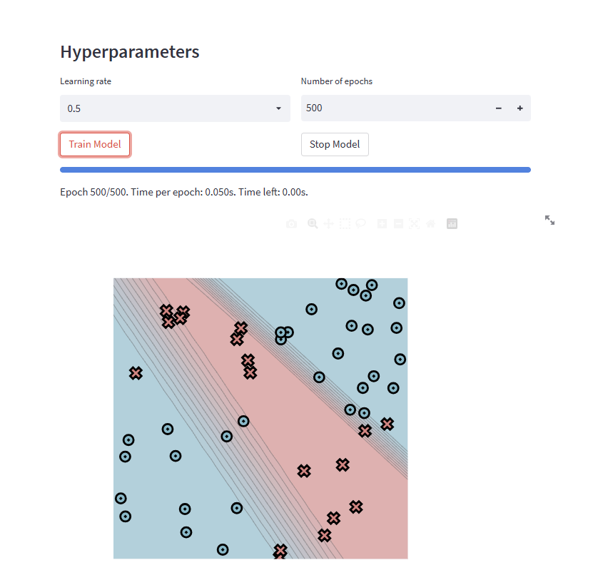

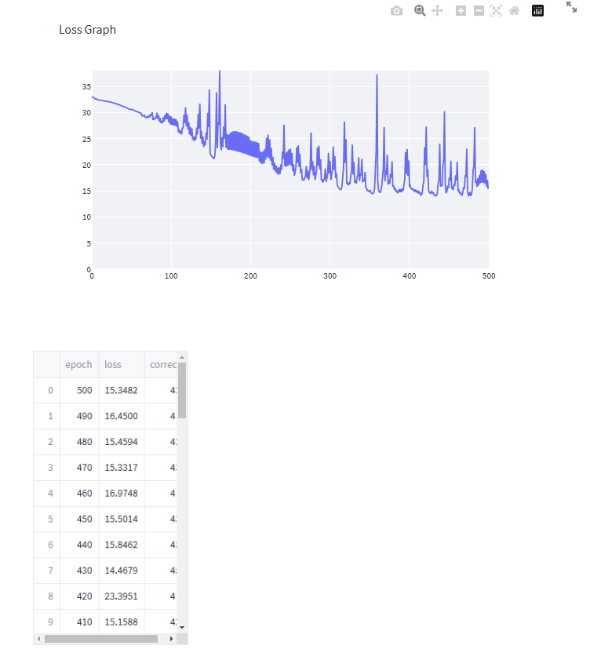

```
Epoch: 0/500, loss: 0, correct: 0
Epoch: 10/500, loss: 32.44020483463936, correct: 32
Epoch: 20/500, loss: 32.17030995373934, correct: 32
Epoch: 30/500, loss: 31.757924537788366, correct: 32
Epoch: 40/500, loss: 31.226445347225813, correct: 32
Epoch: 50/500, loss: 30.648056285421962, correct: 32
Epoch: 60/500, loss: 30.045735805384847, correct: 36
Epoch: 70/500, loss: 29.03374068047321, correct: 40
Epoch: 80/500, loss: 28.666504671380185, correct: 39
Epoch: 90/500, loss: 27.99719875963043, correct: 38
Epoch: 100/500, loss: 27.719973642944844, correct: 36
Epoch: 110/500, loss: 26.247720815745648, correct: 39
Epoch: 120/500, loss: 27.378997490661686, correct: 37
Epoch: 130/500, loss: 24.530709649071635, correct: 40
Epoch: 140/500, loss: 24.00104944375845, correct: 39
Epoch: 150/500, loss: 22.0966425831101, correct: 43
Epoch: 160/500, loss: 28.128256185013395, correct: 32
Epoch: 170/500, loss: 23.259543953064814, correct: 39
Epoch: 180/500, loss: 22.724721562499735, correct: 38
Epoch: 190/500, loss: 22.27750854122717, correct: 38
Epoch: 200/500, loss: 21.744313244937736, correct: 38
Epoch: 210/500, loss: 21.280248604103754, correct: 40
Epoch: 220/500, loss: 20.99620041215635, correct: 39
Epoch: 230/500, loss: 19.078633559019313, correct: 41
Epoch: 240/500, loss: 19.041923312555618, correct: 40
Epoch: 250/500, loss: 20.03268509388224, correct: 39
Epoch: 260/500, loss: 20.391797550259597, correct: 39
Epoch: 270/500, loss: 17.79631335648465, correct: 41
Epoch: 280/500, loss: 17.991969603661502, correct: 42
Epoch: 290/500, loss: 17.00389854644052, correct: 44
Epoch: 300/500, loss: 18.360145760467525, correct: 42
Epoch: 310/500, loss: 16.071772623631443, correct: 45
Epoch: 320/500, loss: 20.36546596307147, correct: 39
Epoch: 330/500, loss: 18.11325559617072, correct: 40
Epoch: 340/500, loss: 18.11351694509624, correct: 39
Epoch: 350/500, loss: 14.872074664131572, correct: 45
Epoch: 360/500, loss: 37.333344158015144, correct: 35
Epoch: 370/500, loss: 16.802645042289445, correct: 43
Epoch: 380/500, loss: 15.767311758355193, correct: 43
Epoch: 390/500, loss: 15.344152831896889, correct: 42
Epoch: 400/500, loss: 20.826045022329012, correct: 42
Epoch: 410/500, loss: 15.158833169664913, correct: 43
Epoch: 420/500, loss: 23.39511415727281, correct: 41
Epoch: 430/500, loss: 14.467879329134744, correct: 45
Epoch: 440/500, loss: 15.846183855272887, correct: 45
Epoch: 450/500, loss: 15.501445802545712, correct: 43
Epoch: 460/500, loss: 16.974775828958386, correct: 41
Epoch: 470/500, loss: 15.331691724509792, correct: 43
Epoch: 480/500, loss: 15.459396365061721, correct: 42
Epoch: 490/500, loss: 16.450018382984556, correct: 41
Epoch: 500/500, loss: 15.348162958683261, correct: 43
```

### Circle

Size of hidden layer=4

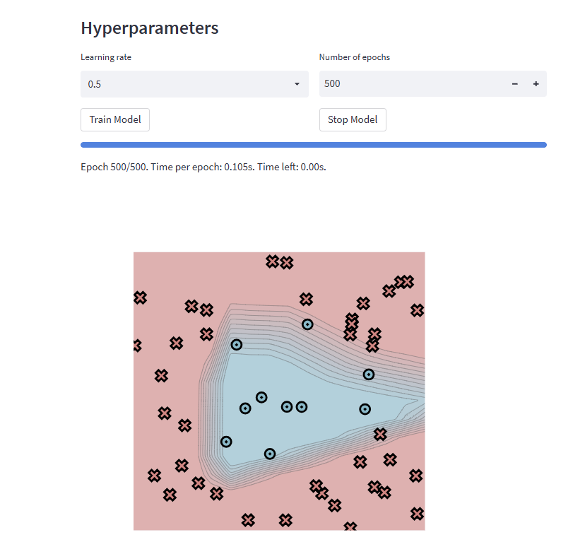

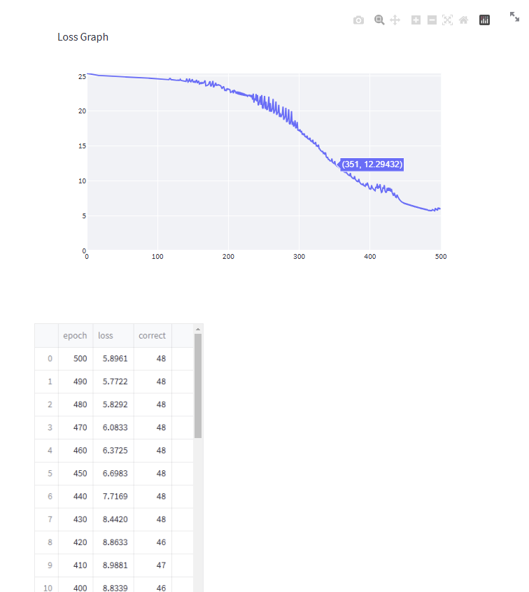

```
Epoch: 0/500, loss: 0, correct: 0
Epoch: 10/500, loss: 25.1634505896847, correct: 40
Epoch: 20/500, loss: 25.07471992564114, correct: 40
Epoch: 30/500, loss: 25.038331211535738, correct: 40
Epoch: 40/500, loss: 24.98268018510551, correct: 40
Epoch: 50/500, loss: 24.909964518045435, correct: 40
Epoch: 60/500, loss: 24.843917330840664, correct: 40
Epoch: 70/500, loss: 24.790448729468093, correct: 40
Epoch: 80/500, loss: 24.741345071211445, correct: 40
Epoch: 90/500, loss: 24.687562813412008, correct: 40
Epoch: 100/500, loss: 24.624762110775002, correct: 40
Epoch: 110/500, loss: 24.548757659682604, correct: 40
Epoch: 120/500, loss: 24.483567755455272, correct: 40
Epoch: 130/500, loss: 24.436247831913562, correct: 40
Epoch: 140/500, loss: 24.297356239876663, correct: 40
Epoch: 150/500, loss: 24.540426823724665, correct: 40
Epoch: 160/500, loss: 23.85022677464299, correct: 40
Epoch: 170/500, loss: 23.614667179866952, correct: 40
Epoch: 180/500, loss: 23.38306486571624, correct: 40
Epoch: 190/500, loss: 23.616395781549567, correct: 40
Epoch: 200/500, loss: 23.093965287270365, correct: 40
Epoch: 210/500, loss: 22.889186654563733, correct: 40
Epoch: 220/500, loss: 22.232094996031435, correct: 40
Epoch: 230/500, loss: 22.273525103031577, correct: 40
Epoch: 240/500, loss: 22.433359503086535, correct: 40
Epoch: 250/500, loss: 20.36033258526514, correct: 40
Epoch: 260/500, loss: 21.12416899119063, correct: 40
Epoch: 270/500, loss: 19.632988786319306, correct: 40
Epoch: 280/500, loss: 18.960624978865095, correct: 40
Epoch: 290/500, loss: 19.962887049009854, correct: 40
Epoch: 300/500, loss: 17.22456345165013, correct: 40
Epoch: 310/500, loss: 16.296565701497343, correct: 40
Epoch: 320/500, loss: 15.857628171977026, correct: 40
Epoch: 330/500, loss: 14.54003672695503, correct: 41
Epoch: 340/500, loss: 13.309344020022056, correct: 44
Epoch: 350/500, loss: 12.433667871251307, correct: 45
Epoch: 360/500, loss: 11.588746075105684, correct: 46
Epoch: 370/500, loss: 10.820470533239405, correct: 46
Epoch: 380/500, loss: 10.176768437710257, correct: 46
Epoch: 390/500, loss: 9.424174200841628, correct: 46
Epoch: 400/500, loss: 8.83388653357574, correct: 46
Epoch: 410/500, loss: 8.988133002342728, correct: 47
Epoch: 420/500, loss: 8.863346904132193, correct: 46
Epoch: 430/500, loss: 8.441998963981948, correct: 48
Epoch: 440/500, loss: 7.716886260169485, correct: 48
Epoch: 450/500, loss: 6.698292306346684, correct: 48
Epoch: 460/500, loss: 6.372468388427291, correct: 48
Epoch: 470/500, loss: 6.0832559070743555, correct: 48
Epoch: 480/500, loss: 5.829216552910294, correct: 48
Epoch: 490/500, loss: 5.772159954178919, correct: 48
Epoch: 500/500, loss: 5.896123059782727, correct: 48
```

### Spiral

Size of hidden layer=4

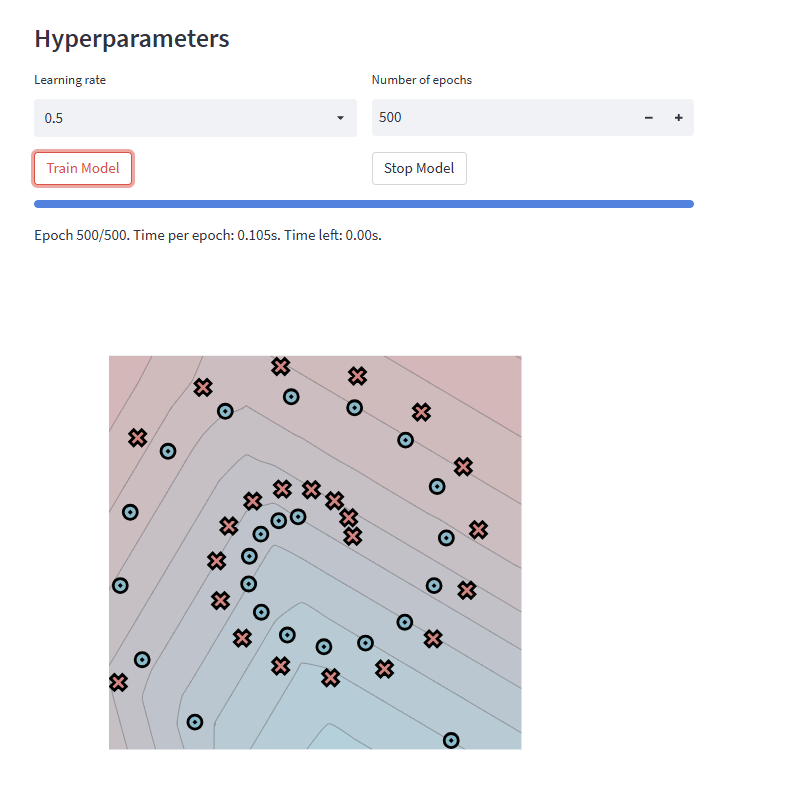

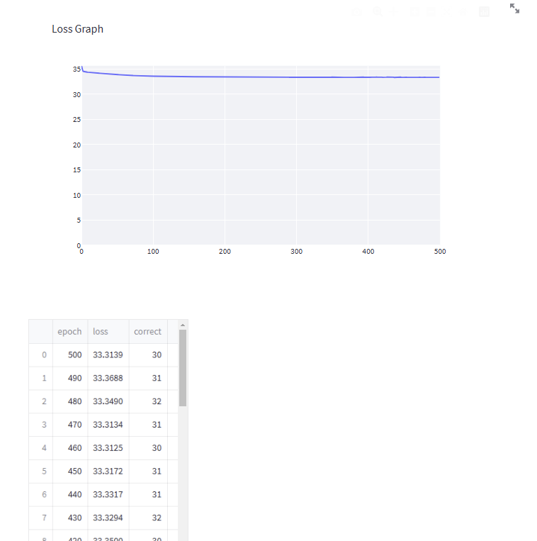

```
Epoch: 0/500, loss: 0, correct: 0
Epoch: 10/500, loss: 34.33976118121786, correct: 29
Epoch: 20/500, loss: 34.20189369021019, correct: 30
Epoch: 30/500, loss: 34.09722137411657, correct: 29
Epoch: 40/500, loss: 33.99005536089522, correct: 29
Epoch: 50/500, loss: 33.88217561239592, correct: 29
Epoch: 60/500, loss: 33.78302147407185, correct: 30
Epoch: 70/500, loss: 33.7046870001967, correct: 29
Epoch: 80/500, loss: 33.64170222826121, correct: 30
Epoch: 90/500, loss: 33.59724532752027, correct: 29
Epoch: 100/500, loss: 33.55894402434531, correct: 32
Epoch: 110/500, loss: 33.52930598620312, correct: 31
Epoch: 120/500, loss: 33.499297751445454, correct: 31
Epoch: 130/500, loss: 33.48548728683597, correct: 30
Epoch: 140/500, loss: 33.468925495167504, correct: 30
Epoch: 150/500, loss: 33.45441094563999, correct: 30
Epoch: 160/500, loss: 33.442023904547824, correct: 30
Epoch: 170/500, loss: 33.43226310862877, correct: 31
Epoch: 180/500, loss: 33.42265000669737, correct: 32
Epoch: 190/500, loss: 33.41233170641993, correct: 32
Epoch: 200/500, loss: 33.40415806775492, correct: 32
Epoch: 210/500, loss: 33.39808287111884, correct: 32
Epoch: 220/500, loss: 33.38876797302632, correct: 31
Epoch: 230/500, loss: 33.38543111391884, correct: 31
Epoch: 240/500, loss: 33.37580065504, correct: 32
Epoch: 250/500, loss: 33.374237993141804, correct: 31
Epoch: 260/500, loss: 33.36769740385681, correct: 31
Epoch: 270/500, loss: 33.35788323464182, correct: 31
Epoch: 280/500, loss: 33.34716370627925, correct: 31
Epoch: 290/500, loss: 33.348183277735295, correct: 30
Epoch: 300/500, loss: 33.34180353764044, correct: 30
Epoch: 310/500, loss: 33.337918315963826, correct: 30
Epoch: 320/500, loss: 33.33687195045063, correct: 30
Epoch: 330/500, loss: 33.32570365949847, correct: 30
Epoch: 340/500, loss: 33.327235474090614, correct: 30
Epoch: 350/500, loss: 33.37001868007652, correct: 30
Epoch: 360/500, loss: 33.32502186811639, correct: 31
Epoch: 370/500, loss: 33.322944968195564, correct: 31
Epoch: 380/500, loss: 33.3237387055567, correct: 31
Epoch: 390/500, loss: 33.40060840937069, correct: 31
Epoch: 400/500, loss: 33.40378029632604, correct: 31
Epoch: 410/500, loss: 33.355360320771794, correct: 31
Epoch: 420/500, loss: 33.35002115845868, correct: 30
Epoch: 430/500, loss: 33.32935067196667, correct: 32
Epoch: 440/500, loss: 33.331678757457176, correct: 31
Epoch: 450/500, loss: 33.31720084480596, correct: 31
Epoch: 460/500, loss: 33.31246658718372, correct: 30
Epoch: 470/500, loss: 33.313356205560716, correct: 31
Epoch: 480/500, loss: 33.34902808927222, correct: 32
Epoch: 490/500, loss: 33.36876821069862, correct: 31
Epoch: 500/500, loss: 33.313854607298175, correct: 30
```
